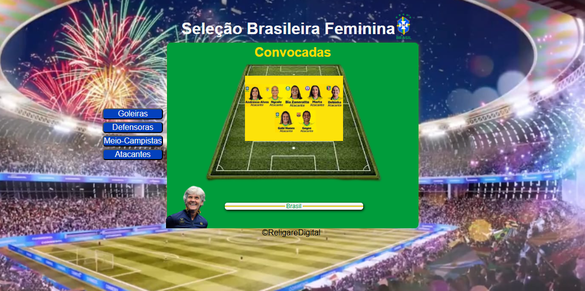
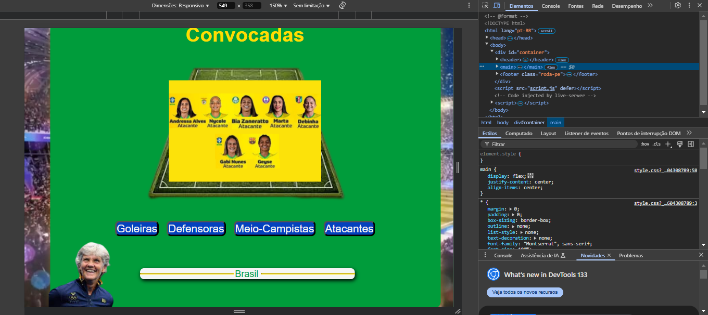
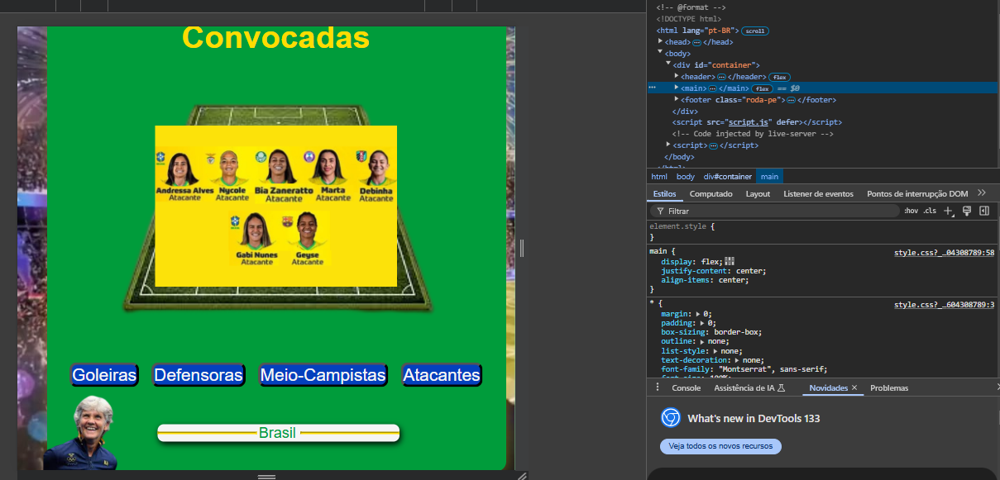

<!-- @format -->

# Seleção Brasileira Feminina ⚽🇧🇷

Este projeto é um estudo de interatividade com JavaScript, onde é possível visualizar jogadoras
da Seleção Brasileira Feminina de Futebol ao clicar nos botões correspondentes às suas respctivas posições.

## 🔥 Funcionalidades

- Exibição das jogadoras conforme a posição (Goleiras, Defensoras, Meio-Campistas e Atacantes).
- Design responsivo para diferentes tamanhos de tela.
- Código limpo e organizado.
-

## 💻 Tecnologias Utilizadas

- HTML5
- CSS3
- JavaScript (DOM Manipulation)

## 🚀 Como Executar

Clone o repositório:

```bash
git clone https://github.com/holiveira07/selecao_feminina.git
```

Abra o arquivo index.html no navegador.

## 📷 Imagens do Projeto





# 📌 Aprendizados
- Manipulação do DOM com addEventListener.
- Uso de querySelectorAll para otimizar eventos.
- Aplicação de media queries para responsividade.
  
 ### Se você gostou do projeto, deixe uma ⭐ no repositório!